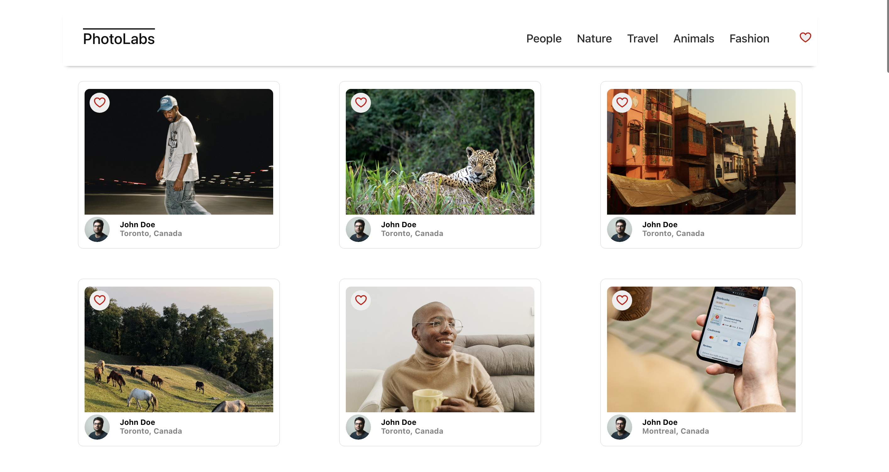
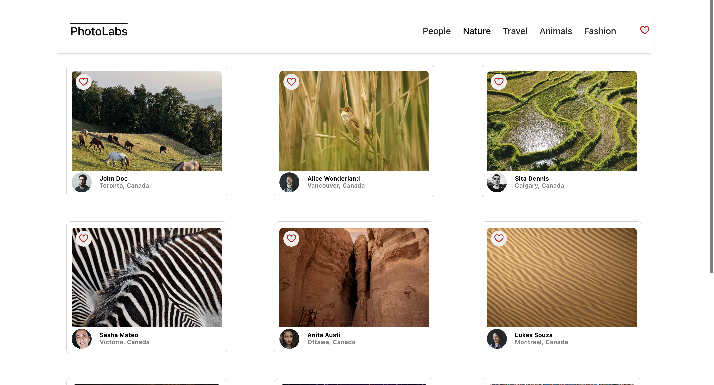

# Photolabs
react-based single page app that allows users to view photos based on categories


## Steps to start the Application

Install dependencies with `npm install` in each respective `/frontend` and `/backend`.

## [Frontend] Running Webpack Development Server

```sh
cd frontend
npm start
```

## [Backend] Running Backend Servier

Read `backend/readme` for further setup details.

```sh
cd backend
npm start
```

## Screenshots

### PhotoLabs Welcome Page


### Liked photo in modal


## Photos based on categories


